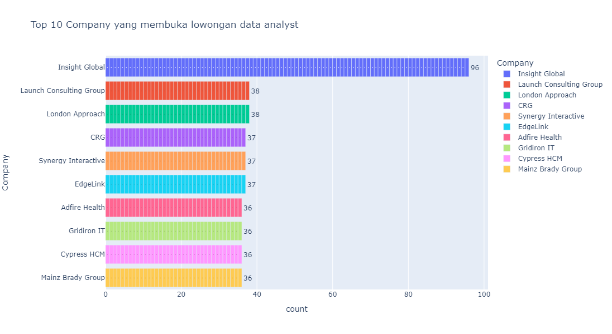
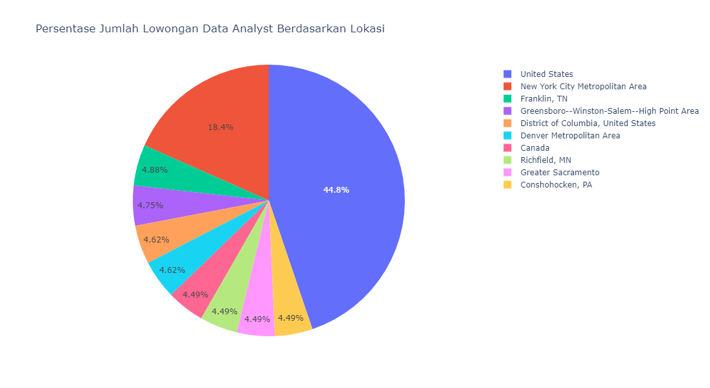
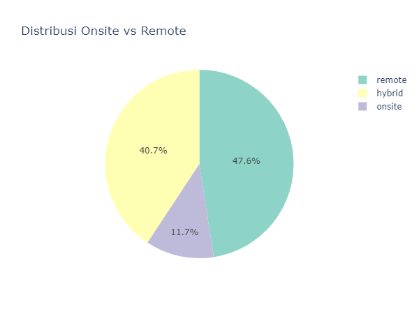
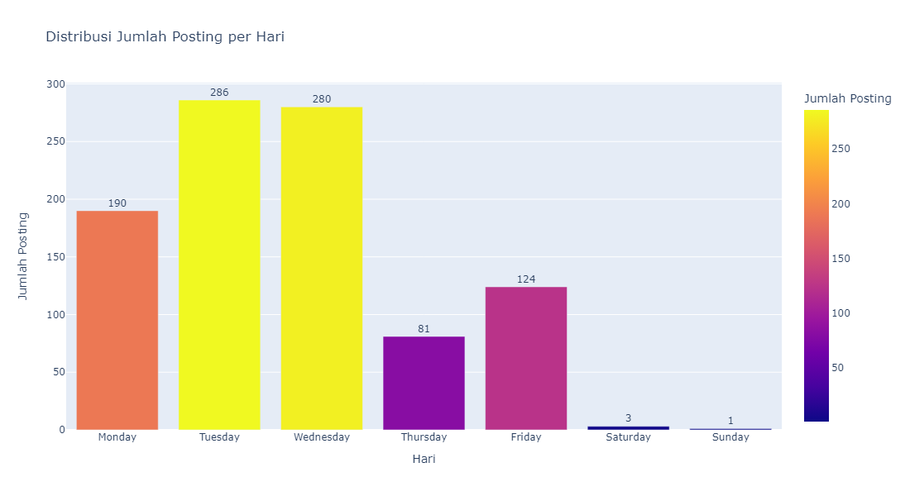
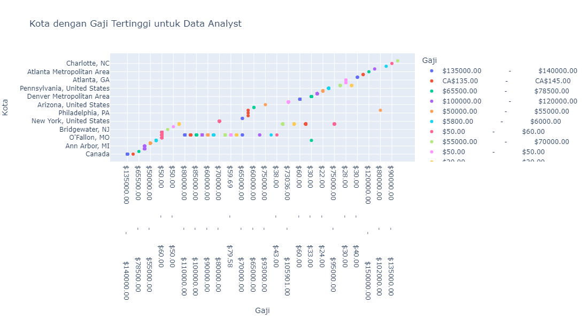
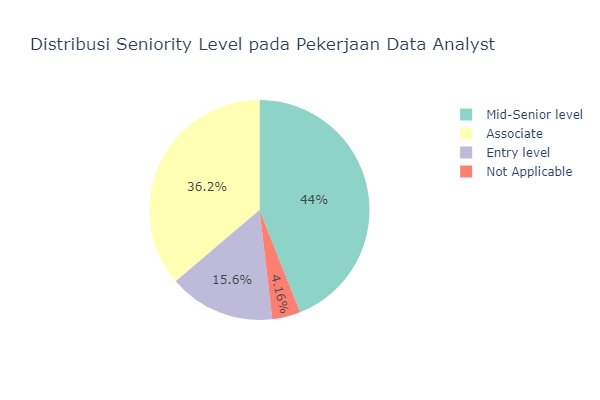
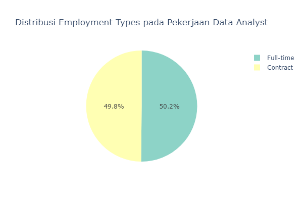
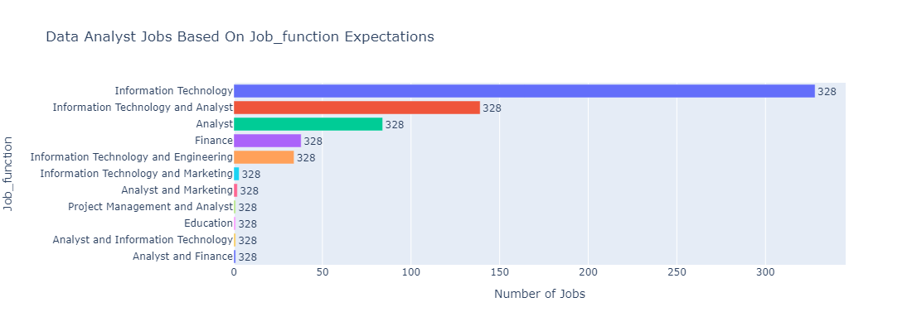
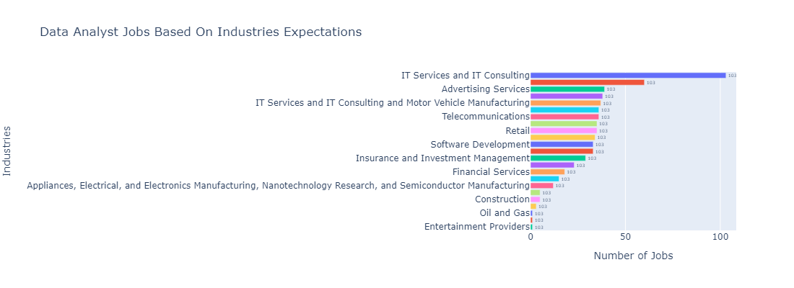

# Analisis Data Pekerjaan Data Analyst di LinkedIn

## Ringkasan

Repositori ini berisi kode dan visualisasi untuk Analisis Data Eksploratif (EDA) terhadap Data Pekerjaan Data Analyst di LinkedIn. Analisis ini melibatkan berbagai aspek, termasuk perusahaan-perusahaan terkemuka, distribusi geografis, jenis pekerjaan, tren pemasangan iklan, kisaran gaji, persyaratan pengalaman, dan preferensi industri.

## Dataset

Dataset yang digunakan berasal dari kaggle dengan judul<a href="https://www.kaggle.com/datasets/cedricaubin/linkedin-data-analyst-jobs-listings/data">LinkedIn Data Analyst jobs listings</a>, dataset bersifat public.

## Visualisasi

Visualisasi menunjukkan wawasan tentang:

- Perusahaan-perusahaan terkemuka dan frekuensi posting lowongan pekerjaan.  

- Distribusi geografis peluang pekerjaan, dengan menyoroti negara-negara dengan posting terbanyak.  

- Distribusi jenis pekerjaan (remote, onsite, hybrid).  

- Tren posting berdasarkan hari dalam seminggu.  

- Wawasan gaji, termasuk kisaran minimum dan maksimum.  

- Persyaratan pengalaman dan distribusi persentase.  

- Keseimbangan antara penawaran pekerjaan kontrak dan penuh waktu.  

- Preferensi industri dan sektor-sektor paling umum.  

## Kesimpulan

EDA ini memberikan wawasan berharga bagi calon Data Analyst, termasuk perusahaan-perusahaan kunci, lokasi pekerjaan yang diinginkan, peluang kerja jarak jauh, dan tren industri. Memahami pola ini dapat membantu pencari kerja dalam menyesuaikan aplikasi dan strategi persiapan. Perlu diingat hasil kesimpulan ini tidak dapat dijadikan patokan utama karena masih banyak kekurangan.

## Penulis

Muhammad Fikri Sandi Pratama - Data Analyst / Data Scientist / Data Engineer